<div align="center">
  
</div>

<p align="center">
  <a href="https://www.linkedin.com/in/nsibi-dhia-elhack-01290b245/"></a>
  <a href="https://dhiaelhack.dev"></a>
  <a href="mailto:nsibidhiaelhack@gmail.com"></a>
  <a href="https://gitlab.com/nsibidhiaelhack"></a>
</p>

<p align="center">
  📍 Bizerte, Tunisia &nbsp;·&nbsp; 🎓 ENISo — Embedded Telecommunications Engineering &nbsp;·&nbsp; 🟢 PFE from January/February 2027
</p>


## 👋 About me

Final-year engineering student at **ENISo** (École Nationale d'Ingénieurs de Sousse), oriented towards **Software Engineering → DevOps → Cloud & Infrastructure**, with a strong **Networks & Systems** foundation.

I build applications in **Python** and **Java**, automate **CI/CD** pipelines with **GitLab** and **Docker**, deploy on **Microsoft Azure**, and work on network and system infrastructure — from **MPLS/VPN backbones (OSPF, BGP, MP-BGP)** to network supervision.

```yaml
role:           Final-year engineering student @ ENISo
target:         Software Engineering | DevOps | Cloud & Infrastructure
differentiator: Networks & Systems (MPLS/VPN, BGP, OSPF)
complementary:  Security · Applied AI · Embedded systems
looking_for:    PFE, 5–6 months, from January/February 2027
languages:      Arabic (native) · French (fluent) · English (fluent)
community:      Founder & President, ACM student chapter @ ENISo
```

🔭 Currently deepening **Java & full-stack** development (Spring Boot, Angular).


## 💼 Experience

| Period | Role | Scope |
|---|---|---|
| **Jul – Aug 2026** | **Network & Systems Administration Intern** — SOTULUB (Tunisia) | Administration and supervision of the network and system infrastructure; support for troubleshooting and maintenance. |
| **Jul – Aug 2025** | **Software Development Intern, Network Supervision** — SOTETEL (Tunisia) | Developed a network supervision software component within the data center team, in collaboration with network administrators. |
| **2025 – Present** | **Founder & President** — ACM Student Chapter, ENISo | Obtained the official ACM chapter affiliation and set up its organization; organizes technical and programming events. |


## 🚀 Selected projects

<table>
<tr>
<td width="50%" valign="top">

### 🔐 DevSecOps CI/CD Pipeline
Full-stack platform with an automated **GitLab CI/CD** and **Docker** pipeline, integrating **SonarQube** for code quality and **OWASP ZAP** for security risk assessment. Deployed on **Microsoft Azure** with **MongoDB Atlas**.

`GitLab CI/CD` `Docker` `SonarQube` `OWASP ZAP` `Azure` `MongoDB Atlas`

</td>
<td width="50%" valign="top">

### 🌐 VPN-MPLS Network Architecture
Multi-site **MPLS/VPN** backbone emulated with **GNS3**, **Docker** and **FRRouting**. Implemented **OSPF**, **BGP** and **MP-BGP**, then validated routing and label switching with **Wireshark**.

`GNS3` `Docker` `FRRouting` `OSPF` `BGP` `MP-BGP` `Wireshark`

</td>
</tr>
<tr>
<td width="50%" valign="top">

### 🦉 HuginnWatch — Network & Server Security Monitoring
Infrastructure monitoring platform built with **FastAPI** and **Streamlit**: **Nmap** vulnerability scans, alerting, and anomaly detection from telemetry data.

`FastAPI` `Streamlit` `Nmap`

</td>
<td width="50%" valign="top">

### 🤖 Agentic RAG Assistant
Document question-answering system with **LangChain**, a **ReAct** agent and **Pinecone**; retrieval quality, tool usage and failure cases analyzed with **LangSmith**.

`LangChain` `ReAct` `Pinecone` `LangSmith`

</td>
</tr>
</table>

<details>
<summary><b>📂 Other projects</b></summary>

<br>

- 🐚 **LAS Shell** — Unix shell written in C: processes, IPC, pipelines, redirections, signals, background jobs, history and aliases.
- 👤 **Real-time facial recognition** — Detection and recognition pipeline with Flask, OpenCV and TensorFlow, trained and tested on custom images.
- ☀️ **Smart solar tracker** — Autonomous solar orientation prototype on ESP32 with LDR sensors and servo motors, in C/C++ (differential light-intensity control).
- 🚗 **Real-time GSM/GPS vehicle tracking** — SIM800L-based embedded system for position transmission, live mapping and trip history.
- 📡 **AI-assisted integrated antenna systems** — Literature review of AI/ML approaches applied to integrated antennas.

</details>

> Repositories: [GitLab](https://gitlab.com/nsibidhiaelhack) · [GitHub](https://github.com/dhiaelhack) · more on [dhiaelhack.dev](https://dhiaelhack.dev)


## 🛠️ Tech stack

<p align="center">
  
</p>

| Category | Technologies |
|---|---|
| **Development** | Python (FastAPI, Flask) · Java (Spring Boot) · JavaScript/TypeScript (Node.js/Express, Angular) · Scala |
| **DevOps & Cloud** | Git · GitLab CI/CD · Docker · Microsoft Azure · SonarQube · Grafana · Prometheus |
| **Networks & Systems** | Linux · OSPF · BGP · MP-BGP · MPLS/VPN · GNS3 · FRRouting · Wireshark |
| **Security** | OWASP ZAP · Nmap · pfSense |
| **Databases** | MongoDB · MongoDB Atlas |
| **AI & Data** | LangChain (ReAct agents, RAG) · Pinecone · LangSmith · TensorFlow · OpenCV |
| **Embedded** | C/C++ · ESP32 · STM32 · Raspberry Pi · SIM800L · POSIX C (processes, IPC, signals) |


## 🏅 Certifications & activities

- 🧠 **NVIDIA Deep Learning Institute** certificate — Natural Language Processing
- 🧪 Active member of **Eureka Club** and **Orange Digital Center Club**
- 🏆 Hackathon participant — embedded systems, IoT & AI


## 📈 Activity

<div align="center">
  <picture>
    <source media="(prefers-color-scheme: dark)" srcset="https://raw.githubusercontent.com/dhiaelhack/dhiaelhack/output/github-snake-dark.svg" />
    <source media="(prefers-color-scheme: light)" srcset="https://raw.githubusercontent.com/dhiaelhack/dhiaelhack/output/github-snake.svg" />
    
  </picture>
</div>

<details>
<summary><b>GitHub stats</b></summary>

<p align="center">
  
  
</p>

</details>

<div align="center">
  
</div>
